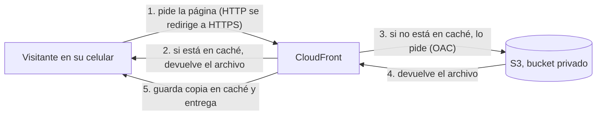
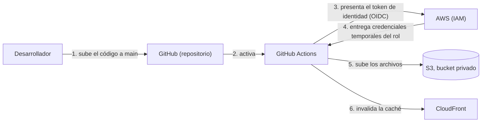

# panaderia-lupe-sitio
Sitio estatico de panaderia lupe en AWS 
## Arquitectura

### Flujo del visitante

```mermaid
flowchart LR
    V["Visitante en su celular"] -->|"1. pide la página (HTTP se redirige a HTTPS)"| CF["CloudFront"]
    CF -->|"2. si está en caché, devuelve el archivo"| V
    CF -->|"3. si no está en caché, lo pide (OAC)"| S3[("S3, bucket privado")]
    S3 -->|"4. devuelve el archivo"| CF
    CF -->|"5. guarda copia en caché y entrega"| V
```

### Flujo del despliegue

```mermaid
flowchart LR
    D["Desarrollador"] -->|"1. sube el código a main"| GH["GitHub (repositorio)"]
    GH -->|"2. activa"| GA["GitHub Actions"]
    GA -->|"3. presenta el token de identidad (OIDC)"| AWS["AWS (IAM)"]
    AWS -->|"4. entrega credenciales temporales del rol"| GA
    GA -->|"5. sube los archivos"| S3[("S3, bucket privado")]
    GA -->|"6. invalida la caché"| CF["CloudFront"]
```
